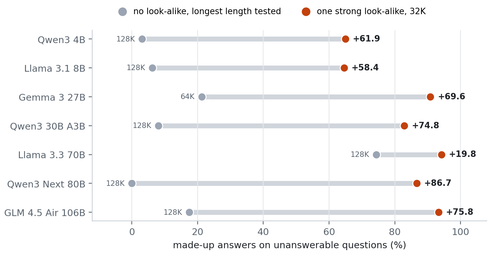
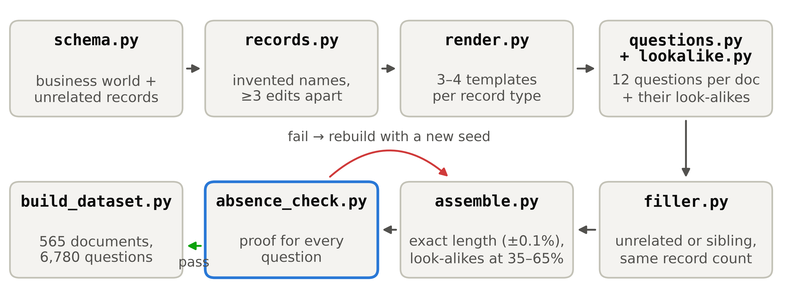
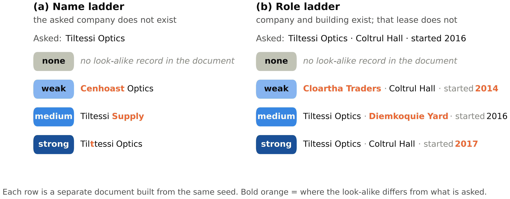
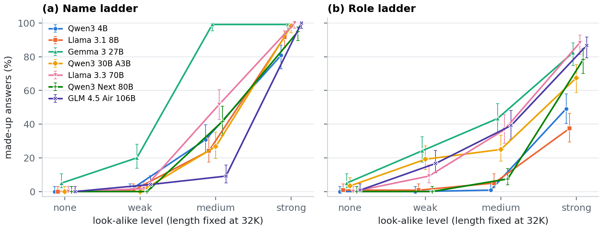
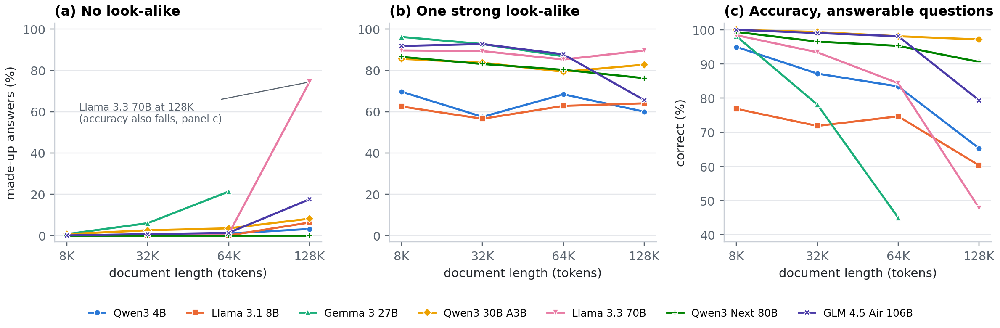
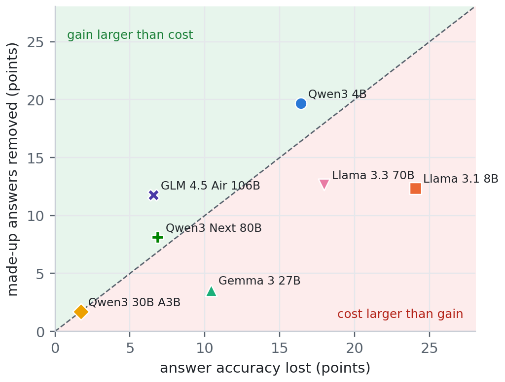
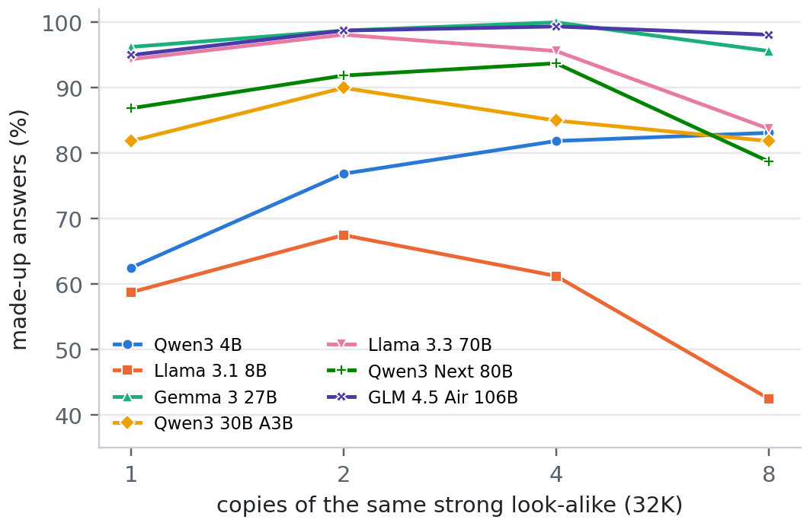
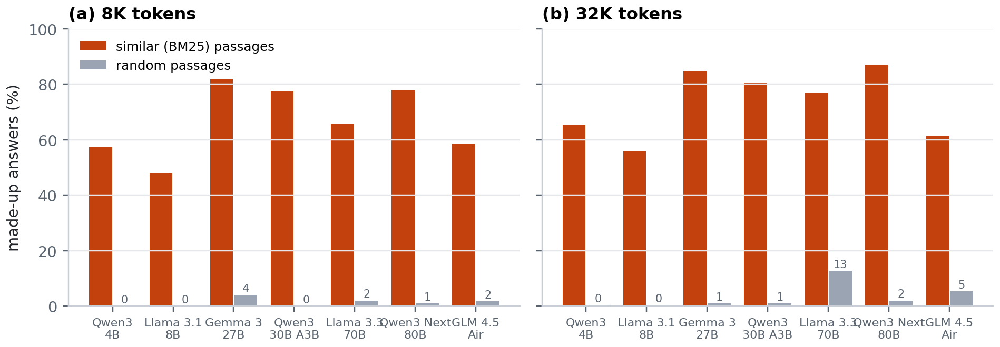

<div align="center">

# Is It the Length or the Look-Alikes? Finding the Cause of Hallucinated Answers in Long Document Question Answering

**Anonymous submission to NAACL 2027 &nbsp;·&nbsp; generator, prompts, raw responses and scored answers**


</div>

> [!NOTE]
> This repository is anonymized for double-blind review. Experiment numbers in this README follow the
> **paper**; the code keeps its internal folder names, mapped in [Experiments](#experiments).

---

## Overview

When the answer to a question is **not** in a long document, language models often **make one up**. Published
benchmarks show that this gets worse as documents get longer. But longer documents also contain more records
that **look like** the asked one, so the two causes are confounded.

To answer, a model needs only **one** matching record; to refuse, it must reject **every** record. So one
convincing look-alike may be enough to cause a made-up answer at any length. We test this with **NullScale**,
a generator of long documents in which length and look-alike content are controlled separately and in which
the answer is **proven absent**.

<p align="center">
  
</p>
<p align="center"><sub><b>Figure 1.</b> Made-up answers on unanswerable questions. Grey: no look-alike, at the longest length each
model was run (64K or 128K). Orange: one strong look-alike in a 32K document. Labels give the gap in points (paper Table 2).</sub></p>

### Key findings

| | Finding |
|---|---|
| **RQ1** | At a fixed length of 32K, one strong look-alike raises made-up answers by **64 to 94 points** in all seven models, and **94–99%** of made-up answers copy the look-alike's value (six of seven models). |
| **RQ2** | With look-alikes fixed, **length alone** causes large damage in only three cells: Gemma 3 27B at 64K (21.2%), Llama 3.3 70B at 128K (74.4%) and GLM 4.5 Air 106B at 128K (17.5%), each where answer accuracy had already fallen. A 128K document without a look-alike gives **20 to 87 points fewer** made-up answers than a 32K document with one. |
| **RQ3** | In the released RIKER2 answers, the share of trap questions with a look-alike is **flat** across lengths (63%, 62%, 61% at 32K, 128K, 200K), so look-alike frequency does not explain the published length curve. |
| **RQ4** | Sibling padding lowers made-up answers by **1.8 to 19.7 points** but costs **1.7 to 24.1 points** of answer accuracy; signal detection shows a shift toward refusal and no gain in discrimination. |
| **Protocol** | Asking all 12 questions of a document in one call raises made-up answers (Qwen3 4B 63.1% → 75.6%; Llama 3.1 8B 57.5% → 95.0%). |
| **Scoring** | Our fixed refusal rules agree with RIKER2's official scorer on **99.21%** of 605,948 answers (Cohen's κ = 0.981). |

---

## Contents

- [What is released](#what-is-released)
- [The NullScale generator](#the-nullscale-generator)
- [Experiments](#experiments)
- [Results](#results)
- [Repository layout](#repository-layout)
- [File formats](#file-formats)
- [Reproducing the paper](#reproducing-the-paper)
- [Models and compute](#models-and-compute)
- [Limitations](#limitations)
- [Citation](#citation) · [License](#license)

## What is released

| Component | Location | Description |
|---|---|---|
| **Generator** | [`nullscale/`](nullscale) | Builds the invented business world, the look-alike ladders, the filler, exact-length documents, 12 questions per document, and the absence proof. Fully seeded. |
| **Prompts** | [`run/prompts.py`](run/prompts.py) | The fixed prompts (`normal`, `strict`, `batch12`) and their Wikipedia variants. A hash of the prompt texts is stored with every answer. |
| **Runner** | [`run/run_vllm.py`](run/run_vllm.py) | vLLM runner with prefix caching, data-parallel shards and a hard check that no document is truncated. |
| **Raw responses** | [`release/responses/`](release) | Every model reply of the seven-model runs, one JSON line per answer, with run metadata (`.meta.json`). |
| **Scored answers** | [`release/scored/`](release), [`outputs/results_cluster/`](outputs/results_cluster) | The same answers with the scoring fields; one `scored.csv` and `summary.md` per run. |
| **Scoring rules** | [`score/`](score) | Refusal rules, answer matching and the look-alike capture tag. No LLM judge. |
| **RIKER2 reanalysis** | [`riker/`](riker), [`outputs/riker/`](outputs/riker) | Look-alike labels for every RIKER2 trap question and the reanalysis. |
| **Real-text data** | [`realdata/`](realdata) | Natural Questions with every answer passage removed; BM25-similar or random Wikipedia passages. |
| **Analysis** | [`analysis/`](analysis), [`outputs/`](outputs) | Every table, figure and statistical test in the paper. |
| **Pre-registration** | [`hypotheses.md`](hypotheses.md) | Research questions and expected outcomes, fixed before the main runs, with a change log. |

**86,100 scored answers** from seven open models enter the paper:

| Paper experiment | Code folder | Scored answers | Runs |
|---|---|---:|---|
| Exp 1 · look-alike level | `exp2` | 42,480 | 7 models × (T = 0 and three seeds at T = 0.7) + strict prompt on 6 models |
| Exp 2 · length × filler | `exp3` | 25,440 | 7 models |
| Exp 3 · number of copies | `exp4` | 6,720 | 7 models |
| Exp 4 · real Wikipedia text | `exp6` | 10,500 | 7 models |
| Exp 5 · protocol (12 per call) | `exp7` | 960 | 2 models × 2 protocols |
| Audit · Llama 3.3 70B in bf16 | `exp3` (`llama33_70b_bf16`) | 960 | robustness check, not counted above |

## The NullScale generator

<p align="center">
  
</p>
<p align="center"><sub><b>Figure 2.</b> The NullScale pipeline. A document that fails the absence check is rebuilt with the next seed.</sub></p>

Each document is a set of records from an invented company archive: companies, people, buildings and leases,
plus unrelated records (shipments, equipment, weather). Invented names are at least three edits apart. A
**look-alike** is a record that matches the asked key in every part but one. Two ladders vary how close it is:

| Level | **Name ladder** — the asked company does not exist | **Role ladder** — company and building exist, the lease does not |
|---|---|---|
| none | no look-alike in the document | no look-alike in the document |
| weak | another company in the same industry | a lease at the asked building for another company |
| medium | the same first word, another second word | the asked company's lease at another building, same year |
| strong | the name one letter away | the asked company at the asked building, another year |

<p align="center">
  
</p>
<p align="center"><sub><b>Figure 3.</b> One example of each ladder. Bold orange marks where the look-alike differs from the question.</sub></p>

**Design properties**

- **Exact lengths.** 8K, 32K, 64K and 128K tokens (Llama 3.1 tokenizer); every document is within 0.1% of its target.
- **Two fillers of equal size.** *Unrelated* records, or *sibling* records of the same kind that clearly lack the asked fact.
- **12 questions per document.** 8 unanswerable and 4 answerable; all questions of a document share one look-alike level.
- **Proven absence.** [`nullscale/absence_check.py`](nullscale/absence_check.py) checks every unanswerable question twice: in the generated ground truth and in the rendered text.
- **Fixed placement.** The look-alike sits in the middle of the document (35–65%), and the question follows the document.

## Experiments

| Paper | Code | What changes | Unanswerable questions per model | Research question |
|---|---|---|---:|---|
| Exp 1 | `exp2` | look-alike level (none / weak / medium / strong), 32K | 960 | RQ1 |
| Exp 2 | `exp3` | length (8K–128K) × no or strong look-alike × two fillers | 2,560 | RQ2, RQ4 |
| Exp 3 | `exp4` | 1, 2, 4 or 8 copies of a strong look-alike, 32K | 640 | RQ1 (count) |
| Exp 4 | `exp6` | real Wikipedia text: similar or random passages, 8K and 32K | 1,200 (+300 answerable controls) | RQ1 on real text |
| Exp 5 | `exp7` | one question per call vs 12 questions in one call, 32K | 320 (two models) | protocol |
| RIKER2 | `exp1` | reanalysis of 605,948 released answers, split by look-alike presence | — | RQ3 |

## Results

All rates are made-up answers on unanswerable questions (%), at temperature 0. 95% Wilson intervals are in each
run's `summary.md`. Full tables: [`outputs/figures_main/main_results.md`](outputs/figures_main/main_results.md)
and [`outputs/overnight/report.md`](outputs/overnight/report.md).

### Exp 1 — One look-alike at a fixed length (RQ1)

| Model | none | weak | medium | strong | Copied the look-alike's value |
|---|---:|---:|---:|---:|---:|
| Qwen3 4B | 0.0 | 0.4 | 15.8 | **65.0** | 99% |
| Llama 3.1 8B | 0.4 | 0.8 | 14.6 | **64.6** | 98% |
| Gemma 3 27B | 5.0 | 22.1 | 71.2 | **90.8** | 58% |
| Qwen3 30B A3B | 1.7 | 9.6 | 25.8 | **82.9** | 96% |
| Llama 3.3 70B | 0.0 | 5.4 | 44.2 | **94.2** | 95% |
| Qwen3 Next 80B | 0.0 | 0.0 | 24.6 | **86.7** | 98% |
| GLM 4.5 Air 106B | 0.4 | 10.4 | 24.2 | **93.3** | 94% |

<p align="center">
  
</p>
<p align="center"><sub><b>Figure 4.</b> Exp 1 split by ladder (120 unanswerable questions per point, 95% Wilson intervals). The role ladder never
changes a name, so a made-up answer there cannot be read as typo correction.</sub></p>

<details>
<summary><b>Exp 1 and Table 2 by ladder</b> (strong minus none: name ladder 81–100 points, role ladder 37–88 points)</summary>

| Model | Ladder | none | weak | medium | strong | Strong − none | No look-alike, longest length | Gap to strong at 32K |
|---|---|---:|---:|---:|---:|---:|---:|---:|
| Qwen3 4B | name | 0.0 | 0.8 | 30.8 | 80.8 | +80.8 | 0.0 (128K) | 80.8 |
| Qwen3 4B | role | 0.0 | 0.0 | 0.8 | 49.2 | +49.2 | 6.2 (128K) | 42.9 |
| Llama 3.1 8B | name | 0.0 | 0.8 | 24.2 | 91.7 | +91.7 | 8.1 (128K) | 83.5 |
| Llama 3.1 8B | role | 0.8 | 0.8 | 5.0 | 37.5 | +36.7 | 4.4 (128K) | 33.1 |
| Gemma 3 27B | name | 5.0 | 20.0 | 99.2 | 99.2 | +94.2 | 8.1 (64K) | 91.0 |
| Gemma 3 27B | role | 5.0 | 24.2 | 43.3 | 82.5 | +77.5 | 34.4 (64K) | 48.1 |
| Qwen3 30B A3B | name | 0.0 | 0.0 | 26.7 | 98.3 | +98.3 | 0.6 (128K) | 97.7 |
| Qwen3 30B A3B | role | 3.3 | 19.2 | 25.0 | 67.5 | +64.2 | 15.6 (128K) | 51.9 |
| Llama 3.3 70B | name | 0.0 | 1.7 | 51.7 | 100.0 | +100.0 | 61.9 (128K) | 38.1 |
| Llama 3.3 70B | role | 0.0 | 9.2 | 36.7 | 88.3 | +88.3 | 86.9 (128K) | 1.5 |
| Qwen3 Next 80B | name | 0.0 | 0.0 | 41.7 | 95.0 | +95.0 | 0.0 (128K) | 95.0 |
| Qwen3 Next 80B | role | 0.0 | 0.0 | 7.5 | 78.3 | +78.3 | 0.0 (128K) | 78.3 |
| GLM 4.5 Air 106B | name | 0.0 | 4.2 | 9.2 | 100.0 | +100.0 | 0.0 (128K) | 100.0 |
| GLM 4.5 Air 106B | role | 0.8 | 16.7 | 39.2 | 86.7 | +85.8 | 35.0 (128K) | 51.7 |

Sources: [`B_ladder_exp1.csv`](outputs/overnight/B_ladder_exp1.csv) and [`B_ladder_table2.csv`](outputs/overnight/B_ladder_table2.csv).
Counting made-up answers that flag a mismatch as refusals lowers the strong-minus-none effect by at most 3.3 points
in any model and ladder ([`C_three_way.csv`](outputs/overnight/C_three_way.csv)).
</details>

### Exp 2 — Length with the look-alike content fixed (RQ2)

<p align="center">
  
</p>
<p align="center"><sub><b>Figure 5.</b> (a) Without a look-alike, length alone moves the rate only late and in few models. (b) With a strong
look-alike, the rate is high at every length. (c) Accuracy on answerable questions in the same documents: the large
length effects in (a) appear only where accuracy has already fallen. Fillers pooled; 320 unanswerable questions per point.</sub></p>

| Model | No look-alike: 8K | 32K | 64K | 128K | Accuracy: 8K | 32K | 64K | 128K | Breaking length |
|---|---:|---:|---:|---:|---:|---:|---:|---:|:---:|
| Qwen3 4B | 0.0 | 0.0 | 0.9 | **3.1** | 95.0 | 87.2 | 83.4 | 65.3 | 128K |
| Llama 3.1 8B | 0.0 | 0.0 | 0.0 | **6.2** | 76.9 | 71.9 | 74.7 | 60.3 | 128K |
| Gemma 3 27B | 0.6 | **5.9** | 21.2 | – | 98.1 | 78.1 | 45.0 | – | 32K |
| Qwen3 30B A3B | 0.6 | 2.5 | 3.4 | **8.1** | 100.0 | 99.4 | 98.1 | 97.2 | 128K |
| Llama 3.3 70B | 0.0 | 0.3 | 0.6 | **74.4** | 98.4 | 93.4 | 84.4 | 47.8 | 128K |
| Qwen3 Next 80B | 0.0 | 0.0 | 0.0 | 0.0 | 99.4 | 96.6 | 95.3 | 90.6 | none |
| GLM 4.5 Air 106B | 0.0 | 0.6 | 1.2 | **17.5** | 100.0 | 99.1 | 98.1 | 79.4 | 128K |

The **breaking length** (bold) is the first length whose 95% interval lies fully above the 8K interval; this rule
was defined after seeing the data. A dash marks 128K for Gemma 3 27B, which does not fit its window. The 128K cell
of GLM 4.5 Air 106B uses the 40 documents that fit its window. With a document-level bootstrap, every breaking
length is unchanged except GLM 4.5 Air 106B, which moves to 64K
([`F_breaking_bootstrap.csv`](outputs/overnight/F_breaking_bootstrap.csv)).

> [!IMPORTANT]
> **Audit of the Llama 3.3 70B cell at 128K.** All 960 answers were saved. The largest prompt is 128,152 tokens
> against a 131,072-token window, and the runner skips, never truncates, a document that does not fit, so no
> input was cut. Only 2 of 960 outputs reached the 256-token limit. Of the 238 made-up answers without a
> look-alike, 225 copy a value from another record in the document. A rerun in **bf16** gives 68.1% (FP8: 74.4%,
> Fisher p = 0.097) with the same accuracy (50.6% vs 49.4%), so the cell is **not an FP8 artifact**
> ([`A_llama70b_128k_audit.csv`](outputs/overnight/A_llama70b_128k_audit.csv)).

<details>
<summary><b>Exploratory: pooled logistic regression and exchange rate</b></summary>

Fitted after seeing the data, on the 16,960 unanswerable questions of Exp 2, with model fixed effects and a ladder term.

| Term | All answers: log odds (SE) | OR | Without Llama 3.3 70B at 128K: log odds (SE) | OR |
|---|---:|---:|---:|---:|
| One doubling of length | 0.115 (0.017) | 1.12 | −0.008 (0.018) | 0.99 |
| Strong look-alike | 4.818 (0.068) | 123.7 | 5.47 (0.09) | 236.9 |
| Sibling filler | −0.537 (0.050) | 0.58 | −0.482 (0.054) | 0.62 |

With an interaction term, one strong look-alike at 8K adds as much log odds as about six doublings of length
without a look-alike (5.9; bootstrap interval 5.6–6.3; leave one model out 5.4–8.2; leave one family out
5.0–8.8; [`D_exchange_robustness.csv`](outputs/overnight/D_exchange_robustness.csv)). This figure
**extrapolates beyond 128K** and depends on which cells are included, so the paper leads with the
probability-scale comparison of Figure 1.
</details>

### Sibling padding as a context intervention (RQ4)

<table>
<tr>
<td width="46%"></td>
<td>

| Model | Made up: unrel. → sib. | Accuracy lost | Δc | Δd′ |
|---|---:|---:|---:|---:|
| Qwen3 4B | 73.8 → 54.1 | 16.4 | +0.60 | −0.14 |
| Llama 3.1 8B | 67.7 → 55.3 | 24.1 | +0.53 | −0.40 |
| Gemma 3 27B | 93.8 → 90.2 | 10.5 | +0.28 | −0.08 |
| Qwen3 30B A3B | 83.8 → 82.0 | 1.7 | +0.31 | −0.49 |
| Llama 3.3 70B | 94.8 → 82.2 | 18.0 | +0.70 | +0.01 |
| Qwen3 Next 80B | 85.6 → 77.5 | 6.9 | +0.60 | −0.58 |
| GLM 4.5 Air 106B | 94.0 → 82.2 | 6.6 | +0.85 | −0.44 |

</td>
</tr>
</table>
<p><sub><b>Figure 6.</b> Sibling filler against unrelated filler of equal size (Exp 2, strong look-alike). Points above the diagonal remove
more made-up answers than they cost in accuracy. The criterion <i>c</i> rises in every model (more refusals), while
the sensitivity <i>d′</i> does not improve (<a href="outputs/overnight/E_signal_detection.csv">E_signal_detection.csv</a>).</sub></p>

### Exp 3 — More copies of the same look-alike

<table>
<tr>
<td width="46%"></td>
<td>

| Model | 1 | 2 | 4 | 8 | p (1 vs 8) |
|---|---:|---:|---:|---:|---:|
| Qwen3 4B | 62.5 | 76.9 | 81.9 | 83.1 | <0.001 |
| Llama 3.1 8B | 58.8 | 67.5 | 61.3 | 42.5 | 0.005 |
| Gemma 3 27B | 96.2 | 98.8 | 100.0 | 95.6 | 1.000 |
| Qwen3 30B A3B | 81.9 | 90.0 | 85.0 | 81.9 | 1.000 |
| Llama 3.3 70B | 94.4 | 98.1 | 95.6 | 83.8 | 0.004 |
| Qwen3 Next 80B | 86.9 | 91.9 | 93.8 | 78.8 | 0.075 |
| GLM 4.5 Air 106B | 95.0 | 98.8 | 99.4 | 98.1 | 0.218 |

</td>
</tr>
</table>
<p><sub><b>Figure 7.</b> Presence dominates count: one copy already gives most of the effect, and the direction of the count effect
differs by model (Fisher's exact test, 1 vs 8 copies).</sub></p>

### Exp 4 — Real Wikipedia text

<p align="center">
  
</p>
<p align="center"><sub><b>Figure 8.</b> 300 Natural Questions items with every answer passage removed. The context is filled with the most
similar Wikipedia passages (BM25) or with random passages of the same total length.</sub></p>

| Model | Similar, 8K | Random, 8K | Similar, 32K | Random, 32K |
|---|---:|---:|---:|---:|
| Qwen3 4B | 57.3 | 0.0 | 65.3 | 0.3 |
| Llama 3.1 8B | 48.0 | 0.0 | 55.7 | 0.3 |
| Gemma 3 27B | 82.0 | 4.0 | 84.7 | 1.0 |
| Qwen3 30B A3B | 77.3 | 0.0 | 80.7 | 1.0 |
| Llama 3.3 70B | 65.7 | 2.0 | 77.0 | 12.7 |
| Qwen3 Next 80B | 78.0 | 1.0 | 87.0 | 2.0 |
| GLM 4.5 Air 106B | 58.3 | 1.7 | 61.3 | 5.3 |

Similar passages act as natural look-alikes. Between 8% and 28% of these made-up answers equal the true answer,
known from training rather than from the context; they count as made up because they are not grounded in the
given passages.

### Exp 5 — Protocol: one question per call vs twelve

| Model | Made up, one per call | Made up, 12 in one call | Fisher p |
|---|---:|---:|---:|
| Qwen3 4B | 63.1 | 75.6 | 0.021 |
| Llama 3.1 8B | 57.5 | 95.0 | <0.001 |

### RIKER2 reanalysis (RQ3)

Our reading of the released RIKER2 answers reproduces the published fabrication rates exactly in all 465 cells.
We labeled every trap question for a look-alike (a name one or two letters away, a shared first or last name, or
the same names with another date) and compared the 11 models tested at all three lengths.

| Length | Trap questions with a look-alike | Missing field, made up: look-alike present | No look-alike | Difference |
|---|---:|---:|---:|---:|
| 32K | 63% | 42.5 | 19.1 | +23.4 |
| 128K | 62% | 37.5 | 40.2 | −2.7 |
| 200K | 61% | 45.4 | 53.7 | −8.3 |

Look-alike frequency does not change with length, so it cannot explain the published length curve. The
look-alike effect itself is clear at 32K (significantly positive in 9 of 11 models) and absent or reversed at
128K and 200K ([`G_riker_per_model.csv`](outputs/overnight/G_riker_per_model.csv),
[`outputs/riker/exp1_results.md`](outputs/riker/exp1_results.md)).

### Temperature stability

For Exp 1 with a strong look-alike, temperature 0 and three seeds at temperature 0.7 differ by at most 4.6 points
in any model ([`main_results.md`](outputs/figures_main/main_results.md)).

## Repository layout

```
.
├── nullscale/              # the generator
│   ├── schema.py           #   business world: companies, people, buildings, leases + unrelated record types
│   ├── records.py          #   invented names (>= 3 edits apart), values, dates
│   ├── render.py           #   3-4 text templates per record type
│   ├── lookalike.py        #   name and role ladders (none / weak / medium / strong), copies
│   ├── questions.py        #   8 unanswerable + 4 answerable questions per document
│   ├── filler.py           #   unrelated or sibling filler of equal record count
│   ├── assemble.py         #   exact-length documents, look-alike placement
│   ├── absence_check.py    #   proof that every unanswerable question has no answer
│   ├── build_dataset.py    #   builds all experiments from configs/experiments.yaml
│   └── config.py           #   loads and checks the three config files
├── run/                    # prompts.py, run_vllm.py (sharded vLLM runner), merge_shards.py, timing_test.py
├── score/                  # refusal_rules.py, match_answer.py, capture_tag.py, score_all.py
├── riker/                  # RIKER2 download, inspection, look-alike labels, reanalysis
├── realdata/               # Natural Questions build (answer passages removed), BM25 / random retrieval
├── analysis/
│   ├── main_results.py     #   main tables, regression and figures
│   ├── overnight_checks.py #   robustness checks A-I (128K audit, ladder split, bootstraps, signal detection, RIKER2 per model)
│   ├── results_summary.py  #   headline numbers
│   └── readme_figures.py   #   the figures in this README
├── scripts/                # environment setup, run scripts (single GPU and Slurm), figures, make_release.py
├── tests/                  # test_absence.py (generator), test_scoring.py (scoring rules)
├── configs/                # paths.yaml, models.yaml, experiments.yaml
├── outputs/
│   ├── results_cluster/    #   one folder per run: scored.csv + summary.md
│   ├── figures_main/       #   main figures, main_results.md / .csv
│   ├── overnight/          #   robustness checks: report.md and CSVs A-I
│   ├── riker/              #   RIKER2 look-alike labels and reanalysis
│   ├── realdata/           #   Exp 4 build reports
│   ├── figures/            #   generator figures (pipeline, ladders, dataset checks)
│   └── timing/             #   prefix-cache timing test
├── release/                # raw responses and scored answers (.jsonl.gz) + MANIFEST.csv
├── docs/figures/           # figures in this README
└── hypotheses.md           # pre-registered research questions and change log
```

## File formats

### Raw responses — `release/responses/<experiment>/<model>/<run>.jsonl.gz`

One JSON object per answer. `<experiment>` is `E1_lookalike_level`, `E2_length_filler`, `E3_copies`,
`E4_wikipedia` or `E5_protocol`; `<run>` is `<prompt>_t<temperature>_s<seed>`, e.g. `normal_t0_s0`. Each run has a
`.meta.json` with the settings, package versions and timings.

| Field | Meaning |
|---|---|
| `qid`, `doc_id`, `probe_id` | question id `<doc_id>/<probe_id>`; `u0`–`u7` unanswerable, `a0`–`a3` answerable |
| `exp` | code experiment (`exp2` … `exp7`, see [Experiments](#experiments)) |
| `model`, `hf_id`, `quantization` | model key in `configs/models.yaml`, served Hugging Face repository, precision |
| `prompt_style`, `prompt_version` | `normal`, `strict` or `batch12`; hash of the prompt texts |
| `temperature`, `top_p`, `seed`, `max_tokens` | decoding settings (`max_tokens` = 256) |
| `question`, `answerable`, `field` | the question as asked; whether the document contains the answer; the asked fact |
| `ladder`, `level`, `copies`, `filler`, `length_k` | the condition: `name`/`role`; `none`…`strong`; 1–8; `unrelated`/`sibling`; 8–128 |
| `gold`, `gold_aliases` | the true answer and its other written forms (`null` and `[]` when unanswerable) |
| `lookalike_values` | the asked fact's value in the look-alike record(s), used for the capture tag |
| `response` | the model's full reply |
| `finish_reason`, `truncated` | `stop` or `length`; `truncated` is true when `max_tokens` was reached |
| `n_prompt_tokens`, `cached_prompt_tokens`, `n_output_tokens` | token counts |
| `raw_batch_response`, `batch_index` | Exp 5 only: the whole numbered reply and the position in it |
| `source`, `setting`, `nq_id`, `true_answers` | Exp 4 only: `wikipedia`, the context setting, the Natural Questions id and its real answers |

### Scored answers — `release/scored/<experiment>/<model>/<run>.scored.jsonl.gz` and `outputs/results_cluster/<exp>_<model>_<run>/scored.csv`

The raw fields plus:

| Field | Values |
|---|---|
| `label` | `correct`, `wrong_refusal`, `wrong` (answerable); `refused`, `made_up` (unanswerable); `other` |
| `outcome` | `correct`, `made_up`, `other` |
| `refusal`, `hedged` | the refusal rule fired; the reply hedges |
| `answer_part` | the part of the reply that carries the answer |
| `source` | where a made-up value came from: `lookalike`, `other_record`, `not_in_document` (Exp 4: `true_answer_from_memory`, `not_the_true_answer`) |
| `captured`, `mentions_lookalike` | the stated value equals the look-alike's value; the reply names the look-alike |
| `scoring_version` | version of the scoring rules |

[`release/MANIFEST.csv`](release/MANIFEST.csv) lists every released file with its experiment, model, run, number of answers and SHA-256.

## Reproducing the paper

**Install** (Linux or WSL, Python 3.11; a CUDA GPU is needed only for the model runs):

```bash
bash scripts/setup_env.sh pc            # or: bash scripts/setup_env.sh cluster
conda activate nullscale
python -m nullscale.config --make-dirs  # checks the configs and creates the work folders
huggingface-cli login                   # Llama and Gemma require accepting their licences
```

Set the work folders in [`configs/paths.yaml`](configs/paths.yaml). Large files (documents, answers, model weights)
stay outside the repository.

**1. Build and verify the data** (CPU, minutes):

```bash
python -m nullscale.build_dataset --exp all   # all NullScale documents and questions, seeded
python -m pytest tests/ -v                    # absence proof and scoring rules
python -m realdata.nq_build                   # Exp 4: 300 NQ items, answer passages removed
python -m realdata.retrieve                   # Exp 4: similar and random Wikipedia contexts
```

**2. Run the models** (vLLM, temperature 0, at most 256 output tokens):

```bash
python -m run.run_vllm --model qwen3_4b --exp exp2           # one model, one experiment (code numbering)
bash scripts/run_h200.sh submit                              # all models as Slurm jobs
python -m run.merge_shards --exp exp2 --model qwen3_4b       # merge data-parallel shards
```

**3. Score and analyse** (CPU, no GPU needed):

```bash
python -m score.score_all                                              # scores + summary.md per run
python -m analysis.main_results    --results outputs/results_cluster   # main tables, regression, figures
python -m analysis.overnight_checks --results outputs/results_cluster  # robustness checks A-I
python -m analysis.readme_figures  --results outputs/results_cluster   # figures in this README
```

Every table and figure can be regenerated from the released scored files with step 3 alone.

**RIKER2 reanalysis** (CPU; downloads 4.65 GB of released answers):

```bash
python -m riker.download_riker && python -m riker.find_lookalikes && python -m riker.reanalyze_riker
python -m score.refusal_rules --riker   # agreement with RIKER2's scorer (99.21%, kappa 0.981)
```

**Package the release** (on the machine holding the answers): `python scripts/make_release.py`

## Models and compute

| Model | Served repository | Precision | Context window |
|---|---|---|---:|
| Qwen3 4B | `Qwen/Qwen3-4B-Instruct-2507` | bf16 | 262,144 |
| Llama 3.1 8B | `meta-llama/Llama-3.1-8B-Instruct` | bf16 | 131,072 |
| Gemma 3 27B | `google/gemma-3-27b-it` | bf16 | 131,072 |
| Qwen3 30B A3B | `Qwen/Qwen3-30B-A3B-Instruct-2507` | bf16 | 262,144 |
| Llama 3.3 70B | `RedHatAI/Llama-3.3-70B-Instruct-FP8-dynamic` | FP8 | 131,072 |
| Qwen3 Next 80B | `Qwen/Qwen3-Next-80B-A3B-Instruct-FP8` | FP8 | 262,144 |
| GLM 4.5 Air 106B | `zai-org/GLM-4.5-Air-FP8` | FP8 | 131,072 |

Serving settings are in [`configs/models.yaml`](configs/models.yaml). All runs used vLLM on NVIDIA H200 GPUs
(141 GB) with prefix caching, so the 12 questions of a document share one cached document. Instruction models
only, no reasoning mode, temperature 0 unless stated. Lengths are counted with the Llama 3.1 tokenizer; per-model
prompt token counts are in [`H_token_counts.csv`](outputs/overnight/H_token_counts.csv).

## Limitations

Most documents are synthetic, template-based, from one business domain and in English; Exp 4 covers real text
with 300 questions at 8K and 32K. Lengths go up to 128K. The scoring rules were validated against RIKER2's
scorer rather than by a human audit of our own outputs. Quantization and model size are confounded for the three
largest models. The look-alike is always placed mid-document with the question after it. The breaking-length
rule, the filler accuracy check and the regression sensitivity analysis were added after seeing the data and
are exploratory. See the Limitations section of the paper for the full list.

## Citation

```bibtex
@inproceedings{anonymous2027length,
  title     = {Is It the Length or the Look-Alikes? Finding the Cause of Hallucinated Answers
               in Long Document Question Answering},
  author    = {Anonymous},
  booktitle = {Submitted to NAACL 2027},
  year      = {2027},
  note      = {Under double-blind review}
}
```

## License

Code is released under the MIT License ([`LICENSE`](LICENSE)). The generated NullScale data, model responses and
scores are released under CC BY 4.0. Natural Questions, Wikipedia passages and RIKER2 keep their original
licences, and model outputs are subject to each model's licence.
